# Assignment-2
* All tasks are here.
## Docker Commands

### Task-1
<hr>

```bash
    1- docker images : show all images
```  

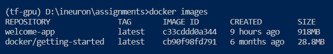
<hr>

```bash
    2- docker ps : show running container
```  

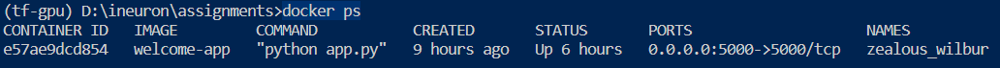

<hr> 

```bash
    3- docker ps --help : show parameters for ps command
``` 

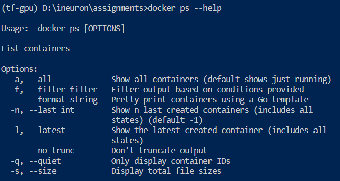

<hr> 

```bash
    4- docker container pause/unpause CONTAINER ID : pause or unpause container 
```

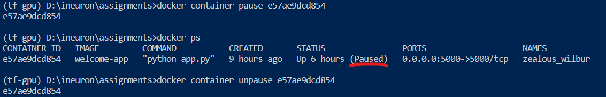

<hr> 

```bash
    5- docker container rm CONTAINER ID : remove container 
```

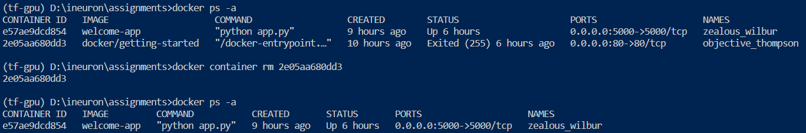

<hr> 

```bash
    6- docker exec -it CONTAINER ID bash : access the running container
```

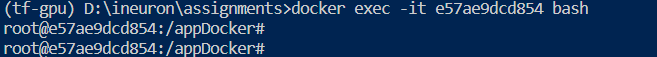

<hr> 

```bash
    7- docker login : login to the docker hub repository
```


<hr> 

```bash
    8- docker restart CONTAINER ID : restart container
```

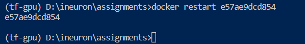

<hr> 

```bash
    9- docker rename name1 name2 : rename container from name1 to name2
```

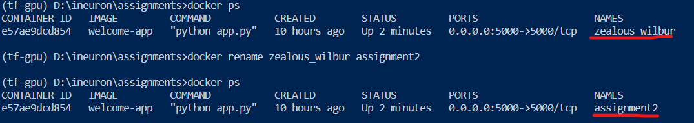

<hr> 

```bash
    10- docker build -t <image_name> . : create image, t:tag
```

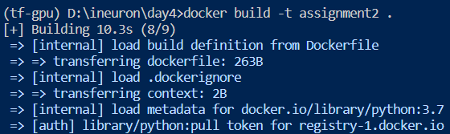

<hr> 

```bash
    11- docker run -d -p host_port:container_port <image_name> . : run image
```

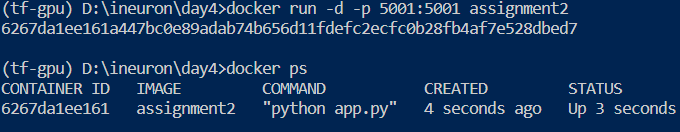

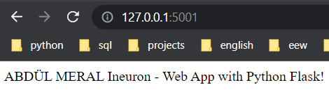

<hr> 

```bash
    12- docker stop <image_name> : stop image
```

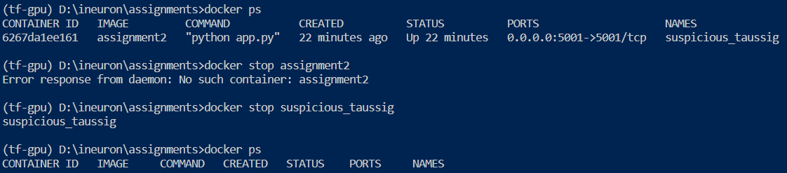

<hr> 

```bash
    13- docker start <image_name> : start image
```

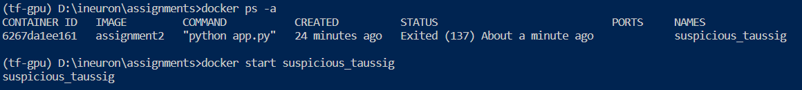

<hr> 

```bash
    14- docker rmi -f <image_name> : remove image, f:force
```

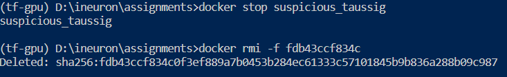

<hr> 

```bash
    15- docker info : Get detailed information about docker installed on the system including the kernel version, number of containers
```

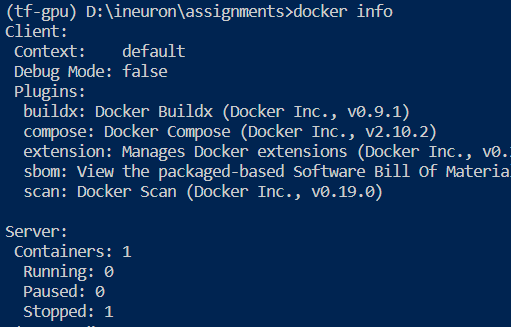


## Task-2

<hr> 

```bash
    docker pull hello-world
```

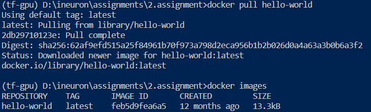

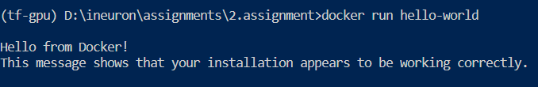

## Task-3

<hr> Dockerfile

```bash
  docker build -t task3 . 
``` 

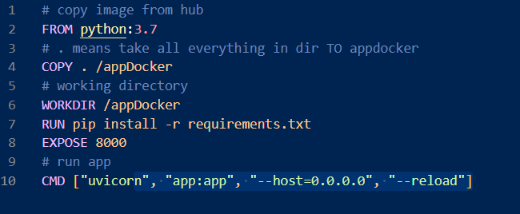

<hr> app.py

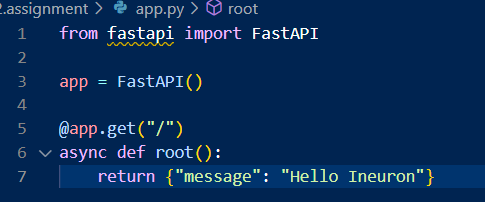

<hr> Web

```bash
  docker run -p 8000:8000 task3
``` 

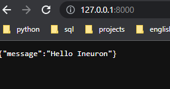

<hr> Push

```bash
  docker login
  docker commit 1bdb6a3f967d abdulmeral/task3
  docker push abdulmeral/task3
``` 
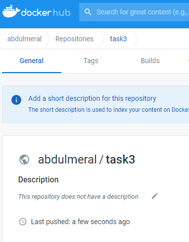

## Task-4

<hr> Create New Repo For This Task

- It is a readme file of docker commands that showing on one page html file. 

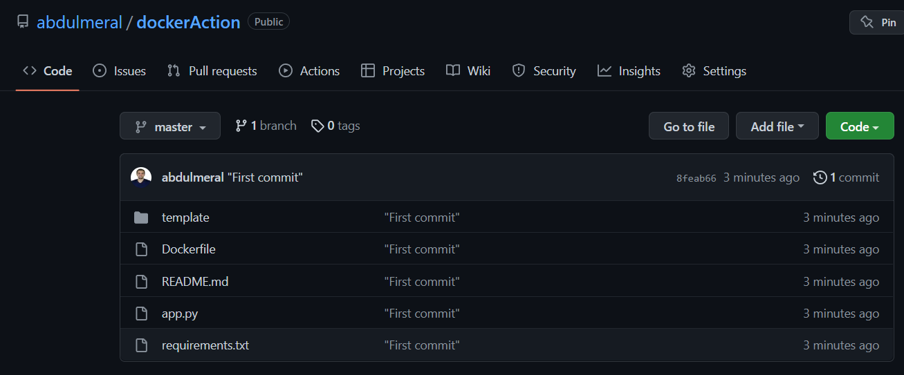

- Action is done. 

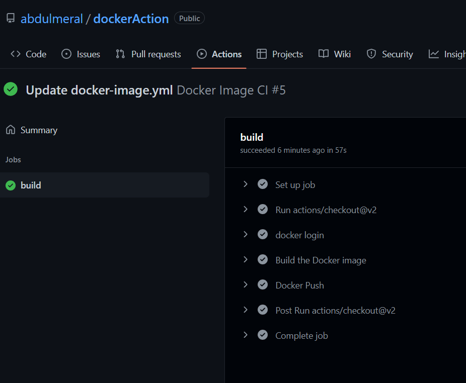

- Image is on DockerHub. 

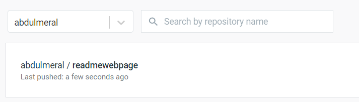

* Done.
